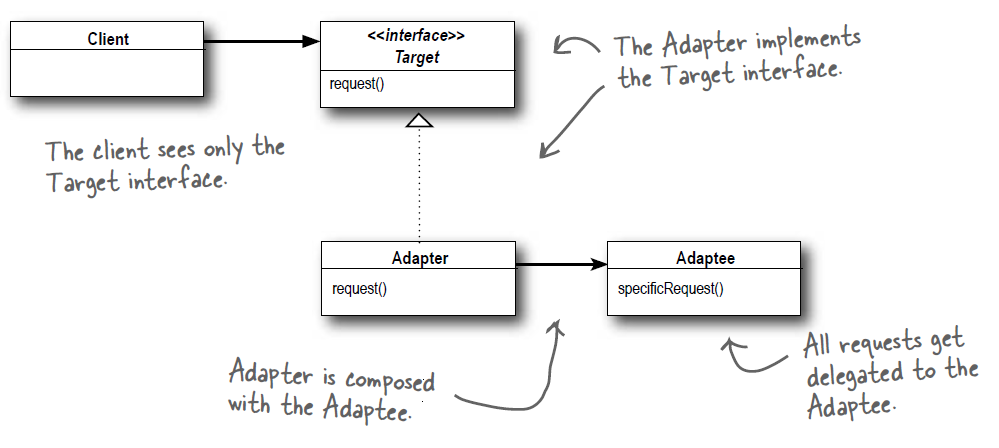
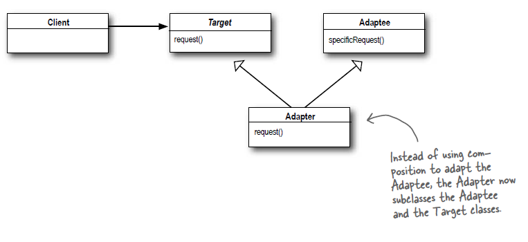

# Adapter Pattern 轉接器模式 - 2

## 轉接器

* 轉接器的是一個特別的介面, 能夠讓不同的介面能夠對接上. 例如3轉2插孔, USB轉typeC等.
* 在程式上的概念是將一個介面透過轉接器轉換到另外一個介面, 而且不用修改這兩個介面任何的程式碼.
	1. 客戶透過目標介面呼叫轉接器的方法, 對轉接器發出請求.
	1. 轉接器透過被轉接者介面, 呼叫被轉接者的一個或多個方法, 並將請求轉給被轉接者.
	1. 客戶接收到呼叫的結果, 不會察覺到中間透過一個轉接器.

## 轉接器模式

* 定義: __將一個類別的介面, 轉換成另一個介面以供客戶使用. 轉接器讓原本介面不相容的類別可以使用.__
* 一段時間過後, 若想要改變介面, 轉接器也可以將改變的部分封裝起來, 客戶就不用跟著修改.
* 被轉接者的任何次類別也能夠使用轉接器.
* 轉接器有兩種:
	1. 物件轉接器: 轉接器 __實踐__ 目標介面.
	1. 類別轉接器: 轉接器 __繼承__ 目標類別和被轉接者. 由於Java不允許多重繼承, 故在Java中並不存在. 類別圖如下:
	

## Demo

1. 請執行Demo, 裡面的DuckAdapter實踐了鴨子偽裝成火雞.
1. EnumeratorIterator:
	* 做一個轉接器, 讓列舉器(Enumeration)有重複器(Iterator)的功能, 包括hasNext(), next(), remove().
	* 顯然列舉器的兩種方法hasMoreElements(), nextElement()可以輕易支援hasNext(), next(), 但remove()如何支援?
	* 結論是列舉器並無法支援remove(), 所以將之定義為拋出UnsupportedOperationException.
1. Demo2展示了雙向轉接器, 適用在系統中新舊並存的時候.
	* 新的API要使用舊的介面, 透過轉接器偽裝成fakeOld, 即可呼叫舊方法oldMethod, 但實際上被轉接到新方法呼叫newMethod.
	* 舊的API要使用新的介面, 透過轉接器偽裝成fakeNew, 即可呼叫新方法newMethod, 但實際上被轉接到舊方法呼叫oldMethod.

## 問題

1. 物件轉接器和類別轉接器的優缺點?
1. 請設計一個轉接器, 可以將重複器轉換成列舉器.

