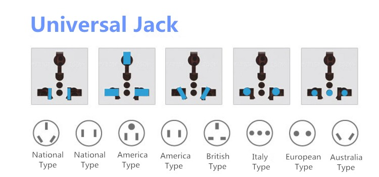

# Adapter Pattern 轉接器模式 - 1

## 轉接器

* 轉接器的是一個特別的介面, 能夠讓不同的介面能夠對接上. 例如3轉2插孔, USB轉typeC等.
* 在程式上的概念是將一個介面透過轉接器轉換到另外一個介面, 而且不用修改這兩個介面任何的程式碼.
	1. 客戶透過目標介面呼叫轉接器的方法, 對轉接器發出請求.
	1. 轉接器透過被轉接者介面, 呼叫被轉接者的一個或多個方法, 並將請求轉給被轉接者.
	1. 客戶接收到呼叫的結果, 不會察覺到中間透過一個轉接器.

## Demo
* 請執行Demo, 這裡展示了把火雞透過轉接器偽裝成鴨子, 讓客戶直接呼叫且無法察覺.
* Turkey是被轉接器, TurkeyAdapter是轉接器, Duck是目標介面.

## 問題
1. 請設計一個轉接器, 把鴨子偽裝成火雞.
1. 一個轉接器只能封裝一個類別嗎?
1. 如果系統中新舊並存, 請問還能夠使用轉接器嗎?
1. 萬一遇到轉接器無法轉接的狀況請問如何處理呢?
