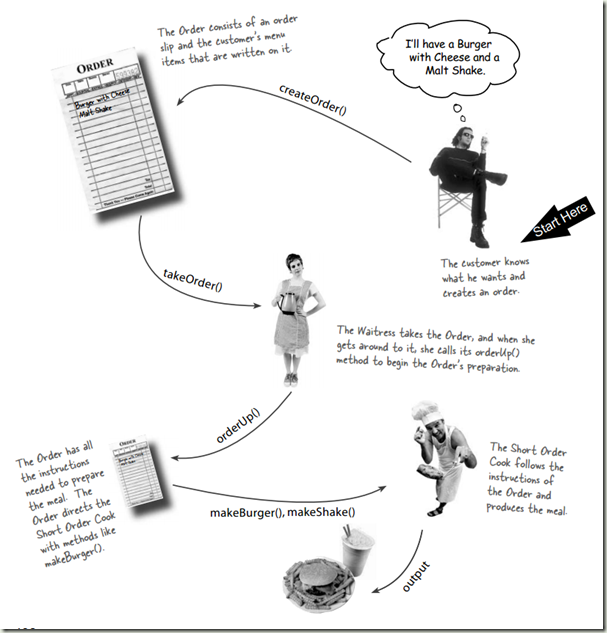

# Command Pattern 命令模式 - 1

## 萬用遙控器
* 設計一個遙控器可以控制7種不同的家電, 如電燈, 風扇, 熱水器等.
* 每個家電的控制方法為在遙控器的插槽內安裝其控制器, 每個控制器不同.
* 這台遙控器上有14個按鈕, 分別為控制7種家電的開關ON和OFF.
* 遙控器設有一個全體共用的復原鈕(UNDO), 會復原最後一個按鈕的動作.

## 餐廳的運作

* 三個角色:
	1. 顧客
	1. 服務生
	1. 廚師
	
* 餐廳作業流程:
	1. 顧客寫菜單(餐點資訊和廚師資訊)
	1. 服務生收菜單
	1. 服務生拿單去廚房
	1. 廚師做料理
	1. 料理完成

## 問題
1. 參考Light, 並設計掛載電燈控制器的萬能遙控器的物件: LightOnCommand, RemoteControl. 請用Demo來測試.
	* 參考stage2.
1. 請說明遙控器問題和餐廳運作的對應關係:

Restaurant|RemoteControl
--|--
Client|You
Chef|Light, Garage, ...
Waiter|RemoteControl
Order|Command(LightOnCommand, LightOffCommand, ...)
new Order()|new Command()
OrderUp()|execute()
takeOrder()|setCommand()
deliver()|buttonWasPushed()