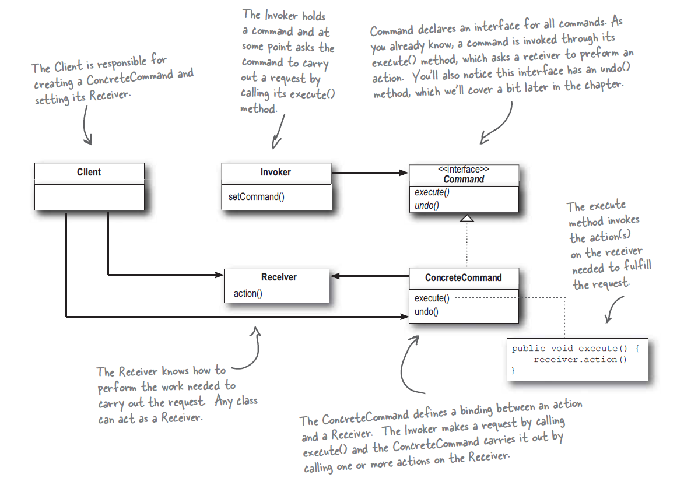

# Command Pattern 命令模式 - 3

## 萬用遙控器
* 設計一個遙控器可以控制7種不同的家電, 如電燈, 風扇, 熱水器等.
* 每個家電的控制方法為在遙控器的插槽內安裝其控制器, 每個控制器不同.
* 這台遙控器上有14個按鈕, 分別為控制7種家電的開關ON和OFF.
* 遙控器設有一個全體共用的復原鈕(UNDO), 會復原最後一個按鈕的動作.

## 命令模式

* 定義: __將請求封裝成物件, 以便使用不同的請求, 佇列, 或者日誌, 參數化其他物件. 命令模式也支援可復原的作業.__
* 命令物件 __封裝一個請求__ ,命令物件中記錄某個接收者的一組動作, 只露出一個execute()方法, 當此方法被呼叫時接收者會進行動作.
* 從外面來看, 其他物件不知道究竟誰是接收者, 進行了什麼動作, 只知道呼叫execute()就能達成目的. 如: 遙控器根本不用知道電器是誰, 只要控制器實踐Command介面即可; 客人不用知道廚師是誰, 只要填菜單請服務員過來收就好.
* 餐廳, 遙控器, 命令模式對照關係表如下:

Restaurant|RemoteControl|Command Pattern
--|--|--
Client|You|Client
Chef|Light, GarageDoor, ...|Receiver
Waiter|RemoteControl|Invoker
Order|Command(LightOnCommand, LightOffCommand, ...)|ConcreteCommand
new Order()|new Command()|new Command()
OrderUp()|execute()|execute()
takeOrder()|setCommand()|setCommand()
deliver()|buttonWasPushed()|triggerMethod()

## Demo
* 增加更多的家電, 總共有Light, Stereo, GarageDoor.
* 在RemoteControl中實作ON和OFF開關各7個.
* 把所有家電的控制器插入遙控器插槽.
* 注意打開Stereo時, 希望可以同時放入CD並調整音量到11, 這些動作都可以在StereoOnWithCdCommand中的execute()完成.
* 執行Demo.
* 觀察一下第4個ON和OFF沒有設定家電, 會印出什麼? 

## 問題
1. 為何要使用NoCommand?
1. 請參考CeilingFan物件, 嘗試自行製作控制器並插入遙控器, 按下開關來測試.