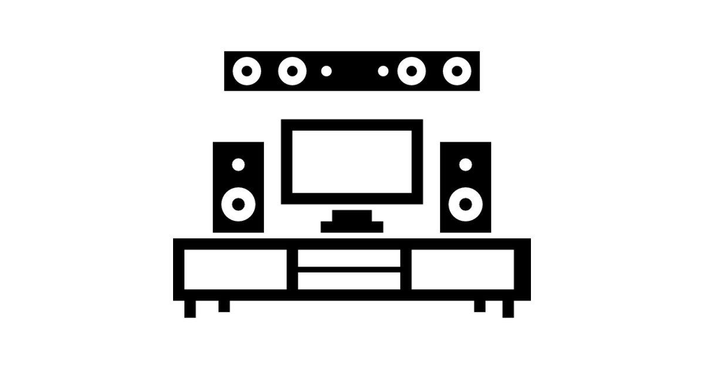

# Facade Pattern 表象模式

## 家庭劇院



* 有一套家庭劇院系統, 含有DVD播放器, 投影機, 環繞音響, 爆米花機, 劇場燈光, 自動螢幕等設備.
* 要開始看欣賞電影前有一系列動作要處理, 例如啟動爆米花機, 放下螢幕, 打開投影機, 放入DVD等, 若想要一鍵搞定所有事情該怎麼做?

## 表象模式

* 定義: __提供一個統一且簡單的介面, 用來存取次系統中的一群介面, 讓次系統更容易使用.__
* 表象模式可以用一個介面, 讓複雜的次系統容易使用, 如果有更複雜的需求, 也可以直接呼叫原來的次系統.
* 表象模式除了簡化介面之外, 也將客戶從次系統中鬆綁出來.

## Least Knowledge(Law of Demeter) 極少化原則

* __極少化原則: 減少物件之間的互動, 只留下密友.__
* 設計一個系統時, 不要讓太多類別捆綁再一起, 免得修改系統中一部分會影響到其他部分. 如果系統之間過多的依賴就會花費許多成本維護, 也會因為太過複雜而不易了解.
* 設計原則: 以某個物件裡面的方法而言, 只應該引用下列物件的方法.
	1. 該物件本件.
	1. 物件是透過方法參數傳遞進來.
	1. 此方法所建立或實體化的物件.
	1. 物件的任何元件.
* 範例:
	```java
	public class Car {
	  Engine engine; // rule 4
	  // other instance variables
	
	  public Car() {
	    // initialize engine, etc.
	  }
	
	  public void start(Key key) { // rule 2
	    Doors doors = new Doors(); // rule 3
	    boolean authorized = key.turns(); // rule 2
	    if (authorized) {
	      engine.start(); // rule 4
	      updateDashboardDisplay(); // rule 1
	      doors.lock(); // rule 3
	    }
	  }
	
	  private void updateDashboardDisplay() {
	    // update display
	  }
	}
	```
## 轉接器模式 vs 表象模式

* 兩者最大的差異並不是目標介面的多寡(轉接器也可以一次轉多個介面, 表象也可以只為一個介面提供簡化介面), 而是目的本質的不同!
* __轉接器模式的目的是要轉換介面: 將一個或多個介面, 變成客戶可以拜訪的一個介面.__
* __表象模式的目的是要簡化介面: 為一個或多個介面, 提供一個簡化的介面.__

## Demo

* 執行Demo, 只需要呼叫表象模式設計好的方法, 就能一鍵啟動.

## 問題

1. 極少化原則告訴我們不要太多類別捆綁在一起, 請問下面這段程式碼有沒有違反極少化原則?
	```java
	public class House {
	  WeatherStation station;
	  
	  public float getTemp() {
	    return station.getThermometer().getTemperature();
	  }
	}
	```
1. 採用極少化原則有什麼缺點?
