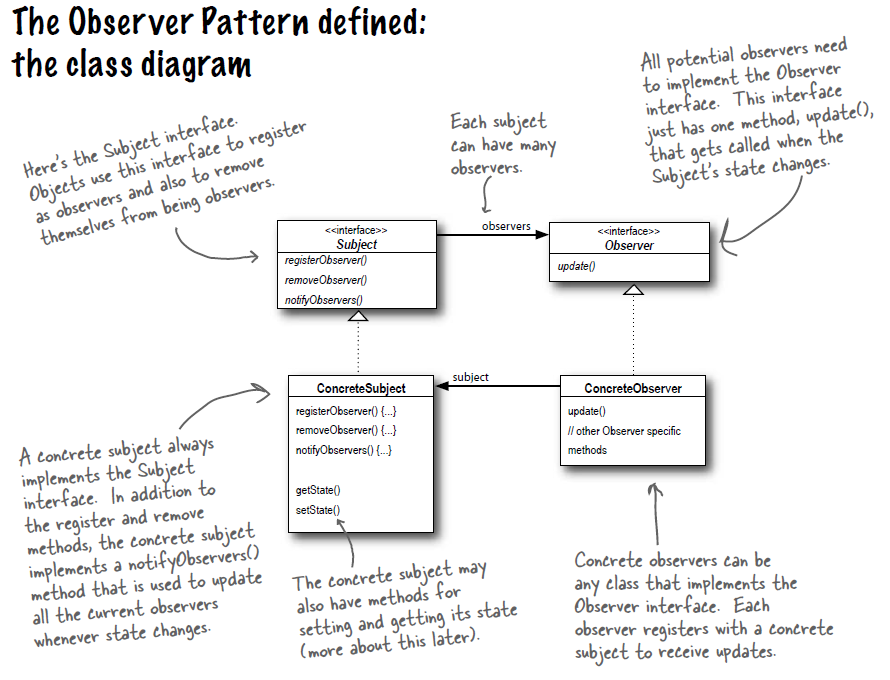

# Observer Pattern 觀察者模式 - 2

## 氣象監測系統

* 氣象站有3個感測器, 分別監測溫度, 濕度和氣壓.
* WeatherData物件可以從氣象站使用getter方法取得資料.
* 取得新資料時, 要更新3個顯示布告板, 分別為CurrentConditionsDisplay, StatisticsDisplay, ForecastDisplay.

## 觀察者模式

* 定義: __物件之間的一對多關係, 當一個物件改變狀態, 其他相依者會收到通知並自動被更新.__
* 觀察者模式可分為主題和觀察者, 主題是具有狀態的物件且能控制狀態; 觀察者可使用這些狀態但不能控制狀態, 故主題對觀察者為一對多關係.
* 主題是真正擁有資料的人, 觀察者依賴主題來更動, 如此不會讓所有人都去控制資料造成混亂.
* 每個布告板其實是有差異的, 但他們同時實踐同一介面, 有了統一方法update, 讓主題在需要通知觀察者時有一個統一的方法.
* 主要優點:
	1. 可以任意地加入新觀察者, 且主題的程式碼無須修改.
	1. 片面地修改主題或觀察者, 並不會影響另一者, 只要兩者之間的介面仍被遵守即可.
	
## 問題

1. 觀察者模式對應到氣象監測系統中的各個角色為何?

Observer Pattern|Weather Station
--|--
Observer|?
ConcreteObserver|?
Subject|?
ConcreteSubject|?
update()|?

2. 請使用觀察者模式來重新設計氣象監測系統.
